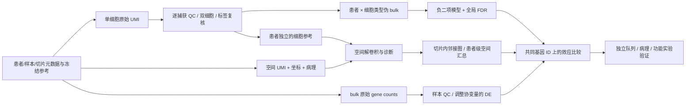

# Breast Cancer Multiomics / 乳腺癌三组学共同分析

**scRNA-seq × 空间转录组 × bulk RNA-seq：保留患者层级、可追溯、可复现的研究工作流。**

本仓库围绕一个可检验的问题构建：**乳腺癌不同临床亚型中，成纤维细胞 ECM
表达程序是否改变，这种改变是否与 T 细胞在肿瘤/间质中的空间分布相对应？**
默认比较为 TNBC 与 HR 阳性/HER2 阴性。它是预设研究假设，尚不是研究发现。

> **交付状态：可运行的分析软件与实验设计，不是已经完成的临床研究。**
> 演示全部使用明确标识的合成数据。真实数据的整队列分析、GPU cell2location
> 拟合、前瞻性实验和独立验证尚未完成。代码质量和图片数量不能保证期刊录用。

## 从这里开始

| 目标 | 入口 |
|---|---|
| 先看结果版式 | [演示图册](docs/demo_figures/GALLERY.md) · [缩略总览](docs/demo_figures/contact_sheet.jpg) |
| 理解研究与实验 | [中文实验方案](docs/experimental_design_zh.md) |
| 跑公开数据 | [真实数据操作指南](docs/real_data_guide_zh.md) · [数据来源](docs/data_sources.md) |
| 检查统计方法 | [统计分析计划](docs/statistical_analysis_plan.md) |
| 查看质量边界 | [验证记录](docs/VALIDATION.md) · [投稿前核查](docs/publication_checklist.md) |
| 改参数/接入自己的数据 | [正式配置](config/production.yaml) · [输入契约](docs/input_contract.md) |

## 5 分钟级演示入口

建议正式分析使用 Linux / WSL2 / HPC；CPU 演示也支持 Windows。
Python 3.11–3.12。首次安装和 JIT 编译耗时取决于网络与机器。

```bash
python -m venv .venv
# Linux/macOS/WSL:
source .venv/bin/activate
# Windows PowerShell 改用： .\.venv\Scripts\Activate.ps1
python -m pip install -e '.[dev]'
pytest -q
bcflow run --config config/demo.yaml
```

查看 `results/demo/figures/GALLERY.md`。演示含 **12 名合成患者、1,920 个细胞、
768 个空间点位、12 个 bulk 样本、800 个基因**；这些数字仅描述测试夹具。
共 **46 张图、138 份完整图形文件**，每图输出 PNG 300 dpi、PDF 和 SVG；
清单记录图题、来源与数据状态。仓库图册使用 120 dpi 预览图；完整导出可从
成功的 GitHub Actions 运行下载，或本地重新生成。

## 流程



## 已实现内容

- 严格原始计数和元数据验证；保留 counts 层、SHA-256、配置及软件版本。
- 捕获级 QC 与可开启的 Scrublet；HVG/PCA/UMAP/Leiden；受审核标签与标志基因图。
- 患者 × 细胞类型聚合；PyDESeq2 协变量模型；gene × cell-type 全局 BH 校正。
- bulk 负二项差异表达、样本相关性、PCA、MA/火山图和变异基因热图。
- 逐切片空间 QC、间隙感知邻接图、程序 Moran's I、病理区室汇总。
- 可运行 NNLS 演示基线；正式配置读取外部 cell2location 后验均值，并保留绝对丰度。
- 患者级 bootstrap 置信区间、同基因效应对照、小型预设标志程序富集。
- 安全下载/解压、GDC 清单快照、Matrix Market 接入器、Snakemake 和 GitHub CI。

**关键区别：**NNLS 输出标为 RNA 混合权重，不能冒充真实细胞比例；正式空间
分析需完成 cell2location 训练、后验诊断及病理核对。`scripts/cell2location_fit.py`
是独立 GPU 环境的可执行适配器，其完整训练未计入已运行验证。

## 正式数据运行

```bash
python scripts/fetch_public.py --part metadata --extract
python scripts/fetch_public.py --part spatial --extract
python scripts/fetch_public.py --part singlecell --extract
python scripts/gdc_bulk.py discover
# 先按真实临床记录审核 samples / subtype / batch / gene ID；详见真实数据指南
python scripts/gdc_bulk.py fetch --selection data/gdc/selected.tsv
# 准备两个 AnnData，并生成正式空间丰度文件后：
bcflow run --config config/production.yaml
```

也可运行可增量调度的工作流：

```bash
python -m pip install -e '.[workflow]'
snakemake -s workflow/Snakefile --configfile config/production.yaml --cores 8
```

Snakemake 从规范化输入契约开始调度；GPU 映射是显式的上游步骤。
原始 FASTQ 处理步骤见[预处理指南](docs/raw_preprocessing.md)，商用 10x 软件、
参考基因组与真实 FASTQ 需要由研究方提供并记录版本。

## 科学边界

GSE176078、Zenodo 4739739 和 TCGA-BRCA 支持不同层面的证据。
不同队列不按患者直接拼接，细胞/spot 不当作独立患者，ER 标签不自动等于
HR+/HER2−，正常乳腺不自动充当癌旁组织，乳腺癌细胞也不能仅凭 EPCAM 判定恶性。
参考见 [Wu et al., Nature Genetics 2021](https://doi.org/10.1038/s41588-021-00911-1)、
[空间数据](https://zenodo.org/records/4739739)、
[GDC STAR Counts](https://docs.gdc.cancer.gov/Encyclopedia/pages/STAR_Counts/)。

## 仓库结构

```text
src/bcflow/        核心分析、统计、空间、绘图和审计
scripts/           下载、格式接入、GPU 解卷积
config/            演示/真实配置与元数据模板
workflow/          Snakemake DAG
tests/             输入/统计/患者层级/空间图/解压测试
docs/              实验设计、SAP、真实数据指南、图册、验证记录
data/              本地数据（不进入 Git）
results/           本地分析产物（不进入 Git）
```

软件为 MIT 许可；公共数据遵循原始数据库/论文条款，患者数据不随代码上传。
引用本仓库时使用 `CITATION.cff`，并另行引用实际使用的数据和算法。
